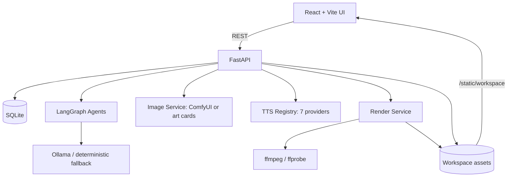
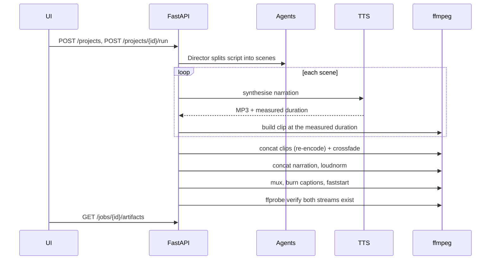

# Architecture

Internal reference. For setup and usage see the [README](../README.md).

---

## System overview



## Render sequence

Narration is synthesised **before** the picture so its measured duration drives
scene length. That ordering is what makes A/V drift structurally impossible.



---

## Render pipeline

### Why it used to produce unplayable files

Five faults compounded, and nothing verified the result, so jobs reported
`completed` while writing broken MP4s.

| Fault | Effect |
|---|---|
| `concat -c copy` on clips with mismatched fps/SAR/timebase | Corrupt container |
| `concat -c copy` on 22.05 kHz Piper + 48 kHz SAPI audio | Garbled narration |
| Clips carried no audio stream | Stream layouts did not match at concat |
| `-c:s mov_text` with `-shortest` | Truncated to the silent video track |
| Scene length taken from the LLM's *guess* | Permanent A/V drift |

### How it works now

1. **Normalise** - every clip is re-encoded to one canonical profile
   (1920x1080, 30 fps, yuv420p, CRF 20, AAC 192 k) *before* concatenation.
   A silent track is added to clips that have no audio.
2. **Measure first** - narration is rendered ahead of picture; `ffprobe`
   reports its true duration and the clip is built to match.
3. **Crossfade compensation** - with `xfade`, total runtime is
   `sum(d) - fade * (n-1)`. Each non-final clip is extended by exactly one fade
   duration so the total still equals the narration length.
4. **Master** - `loudnorm` to -16 LUFS / -1.5 dBTP, captions burned in,
   `+faststart` for instant web playback.
5. **Verify** - `ffprobe` asserts the output has both a video and an audio
   stream and a non-zero duration. A failed render now *fails* instead of
   silently emitting a broken file.

Tuning lives in `.env` (`RENDER_*`). `app/services/ffmpeg_runner.py` resolves
the binaries - explicit `FFMPEG_BIN`, then PATH, then the `imageio-ffmpeg`
bundle - so a missing system FFmpeg is not fatal.

---

## Narration

`app/services/tts/` is a provider registry, not a single engine.

```text
tts/
  base.py       Provider contract + audio post-processing
  registry.py   Ordered fallback chain, retries with backoff
  providers/    elevenlabs, openai, azure, google, edge, piper, pyttsx3
```

- Providers are probed for configuration; unconfigured ones are skipped
  silently rather than raising.
- Long text is chunked on sentence boundaries to respect per-request limits.
- Every result is trimmed of leading/trailing silence, loudness-normalised and
  encoded to MP3 192 kbps / 44.1 kHz regardless of what the engine returned.
- Cache key is `sha256(text + voice + provider + params)`, so repeated renders
  never re-bill a paid API.

Edge is the default because it is neural-quality, free and needs no key, which
means a fresh clone produces good narration with zero configuration.

---

## Data model

| Table | Columns |
|---|---|
| `projects` | id, title, script_text, language, status, timestamps |
| `scenes` | id, project_id, scene_index, script_chunk, description, image/video/audio/subtitle paths, duration_seconds, **audio_duration_seconds**, **tts_provider**, **tts_voice** |
| `jobs` | id, project_id, status, stage, message, progress, processed_scenes, total_scenes, output_video_path, **output_audio_path**, **poster_path**, **captions_path**, last_error, timestamps |
| `job_events` | id, job_id, stage, level, message, created_at |
| `music_generations` | id, title, prompt, composed_prompt, mood, style, energy, instrumentation, duration, model, status, audio_path, timings |

`audio_duration_seconds` is the measured narration length, the single source of
truth for scene timing. `duration_seconds` remains the planner's estimate, kept
only for display before a render exists.

Schema changes are applied by `app/migrations.py` at startup.

---

## API

**Projects and rendering**

```
GET    /health
GET    /dependencies
POST   /projects
GET    /projects
GET    /projects/{id}
PATCH  /projects/{id}/scenes
POST   /projects/{id}/run
POST   /projects/{id}/scenes/regenerate
GET    /projects/{id}/download
GET    /projects/{id}/artifacts     latest render for a project
GET    /jobs/{id}
GET    /jobs/{id}/events
GET    /jobs/{id}/artifacts
```

**Narration**

```
GET    /tts/providers
GET    /tts/voices?provider=
POST   /tts/preview
```

**Music**

```
GET    /music/health
POST   /music/warmup
POST   /music/generate
GET    /music/generations
GET    /music/generations/{id}
POST   /music/generations/{id}/variation
POST   /music/generations/{id}/cancel
POST   /music/generations/{id}/retry
GET    /music/audio/{id}
GET    /music/generations/{id}/waveform?points=140
```

`/projects/{id}/artifacts` exists so the UI can reopen any past render without
tracking job IDs; it resolves the project's most recent completed job.

Rendered assets are served from `/static/workspace`, letting the browser stream
video and audio directly instead of only downloading.

### CORS

`UI_ALLOWED_ORIGINS` is **merged into** the built-in defaults (ports 8501,
5173, 4173, 3000), plus a `localhost`/`127.0.0.1` regex. Setting it to the Vite
default used to *replace* the defaults and silently block the launcher's 8501
origin, so every preflight returned 400 and the UI could not create projects.

---

## Agents

| Agent | Responsibility |
|---|---|
| Director | Split the script, infer style and mood, structure scenes |
| Storyboard | Refine per-scene prompts for image generation |
| Narrator | Prepare narration text and synthesise speech |
| Videographer | Build each scene clip at the measured duration |
| Editor | Concatenate, mix, caption and master the final file |

Ollama is used when reachable; otherwise a deterministic paragraph splitter
runs, so the pipeline never hard-depends on a local LLM.

---

## Design system

### Theming

**Light is the default.** Dark is opt-in via the top-bar toggle and persists in
`localStorage` under `vidcreatoriq.theme`. An inline script in `index.html`
applies the stored theme *before first paint*, so there is no flash.

```
:root                 -> light palette
[data-theme="dark"]   -> dark overrides
```

Every colour, space, radius, shadow and easing is declared exactly once in
`ui/src/styles/tokens.css`. The component layer references tokens only; that
discipline is what lets a single attribute flip repaint the whole product.

Light surfaces climb toward pure white as elevation rises (`--bg-base` #f6f7f9
to `--surface-1` #ffffff) with neutral-tinted shadows, so cards read as lifted
rather than dirty. Status colours darken in light mode (`--success` #0f8f4d)
and brighten in dark (#3ddc84) to hold AA contrast in both.

### Layout

```
+----------+------------------------------------+
| sidebar  | topbar  (title, status, actions)   |
| 256px    +------------------------------------+
| grouped  | content (max 1320px, centred)      |
| nav      |                                    |
+----------+------------------------------------+
```

Below 900 px the sidebar becomes an off-canvas drawer.

Grid children default to `min-width: auto`, which lets wide content push a
`1fr` column past its track and shove the top bar off-screen. `.main`,
`.content`, `.content__inner` and all `.grid > *` set `min-width: 0`, and
tracks use `minmax(min(320px, 100%), 1fr)` so nested grids shrink rather than
overflow.

### Navigation

No view is gated. Every screen is reachable and renders a useful empty state
with a next action. Disabling navigation until data existed made the product
feel broken on first load and hid the Storyboard even when finished projects
were already in the database.

### Accessibility

- Skip link to main content
- Visible focus ring on every interactive element (`--focus-ring`)
- `aria-current` on nav, `aria-pressed` on toggles, `role="log"` on the console
- Progress bars expose `aria-valuenow`/`min`/`max`
- All motion collapses under `prefers-reduced-motion: reduce`
- Captions track attached to the player by default

---

## Testing

```bash
pytest -q                            # 62 tests
python scripts/smoketest_render.py   # services only
python scripts/smoketest_api.py      # full stack
```

Two guards exist because normal tooling could not catch these classes of bug:

- **`test_ui_classes.py`** - TypeScript does not type-check `className`
  strings, so a component can fall back to unstyled HTML while the build stays
  green. That is exactly how the Music Studio regressed. The test extracts
  every class used in `.tsx` files and fails if the stylesheet lacks a rule. It
  also rejects literal colours in the component layer, since only tokens
  respond to `data-theme`.
- **`test_cors_origins.py`** - parametrised over the real misconfiguration that
  broke the UI, asserting port 8501 survives every `.env` permutation.

`test_storyboard_data.py` skips cleanly when no render exists yet, so a fresh
clone does not report false failures.

