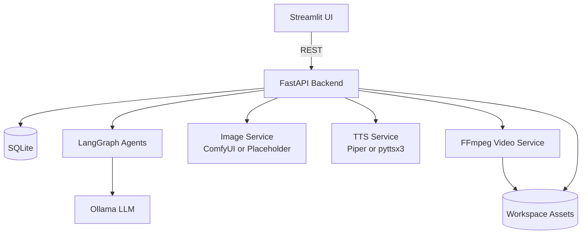
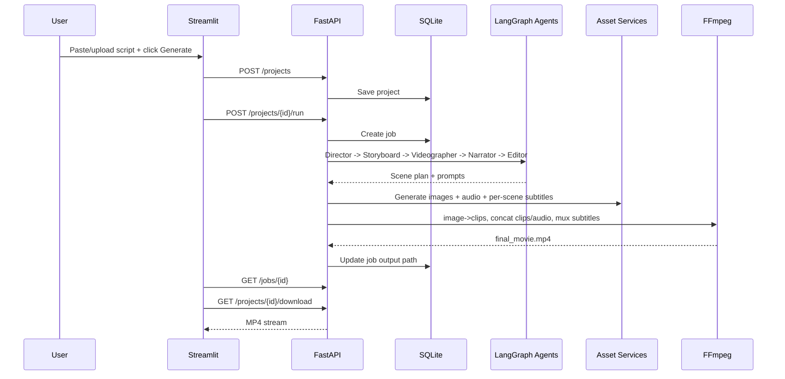

# AI Movie Maker Architecture

## High-Level Architecture Diagram



## Sequence Diagram



## Folder Structure

```text
app/
  api/routes.py
  agents/graph.py
  services/
  config.py
  database.py
  models.py
  schemas.py
  crud.py
streamlit_app.py
docs/architecture.md
samples/sample_script.txt
tests/
```

## Database Schema

- `projects`: id, title, script_text, language, status, timestamps
- `scenes`: id, project_id, scene_index, script_chunk, description, image/video/audio/subtitle paths, duration
- `jobs`: id, project_id, status, stage, message, output_video_path, timestamps

## API Design

- `GET /health`
- `POST /projects`
- `GET /projects`
- `GET /projects/{project_id}`
- `POST /projects/{project_id}/run`
- `GET /jobs/{job_id}`
- `POST /projects/{project_id}/scenes/regenerate`
- `GET /projects/{project_id}/download`

## Agent Responsibilities

- **Director Agent**: split script, infer style/mood, structure scenes
- **Storyboard Agent**: refine scene prompts for image generation
- **Videographer Agent**: coordinate scene clip generation
- **Narrator Agent**: prepare narration text and speech synthesis
- **Editor Agent**: merge clips, voice, and subtitles into final movie

